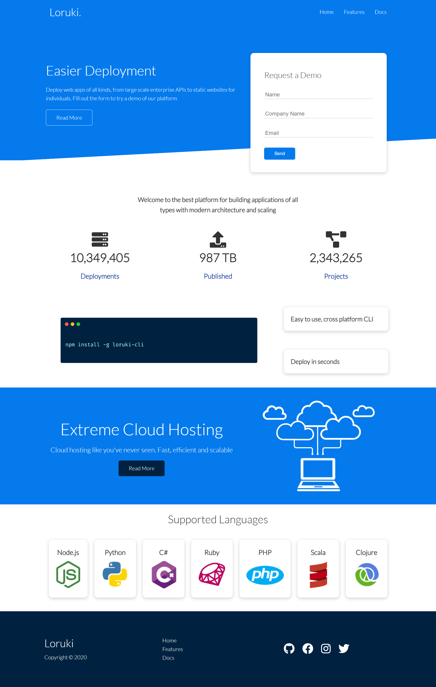

## 🌐 **Cloud Hosting Website**

A simple, responsive website template for a fictional cloud hosting service.
Built with HTML5 and CSS3 (Flexbox & Grid), it demonstrates a modern layout, reusable components, and responsive design principles.

---

🚀 Features

1. Responsive design (mobile, tablet, desktop)

2. Modern layout using CSS Grid & Flexbox

3. Documentation and features section

4. Reusable utility classes (buttons, cards, alerts, etc.)

5. FontAwesome integration for icons

---

🛠️ Technologies Used

1. HTML5

2. CSS3 (Flexbox, Grid, Animations)

3. FontAwesome Icons

---

## 📸 Screenshot  

---

## 🌍 Live Demo  
👉 [View Live Demo](https://cloudhostingwebsite.netlify.app/)

---

Thanks for checking out this project

